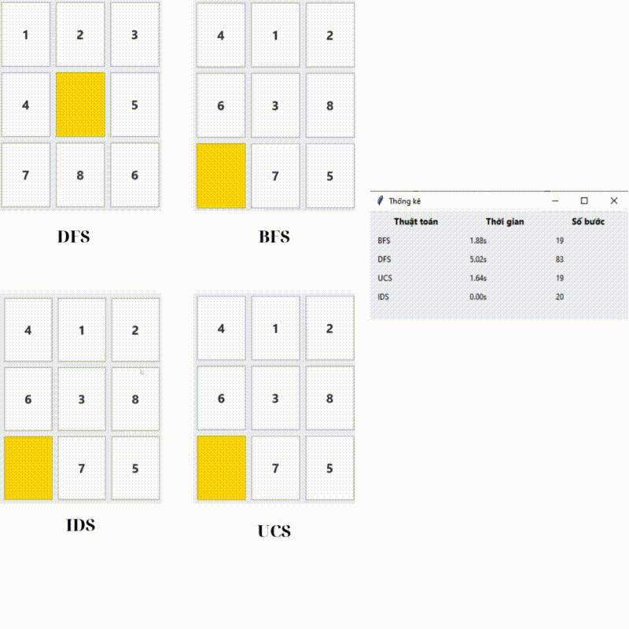
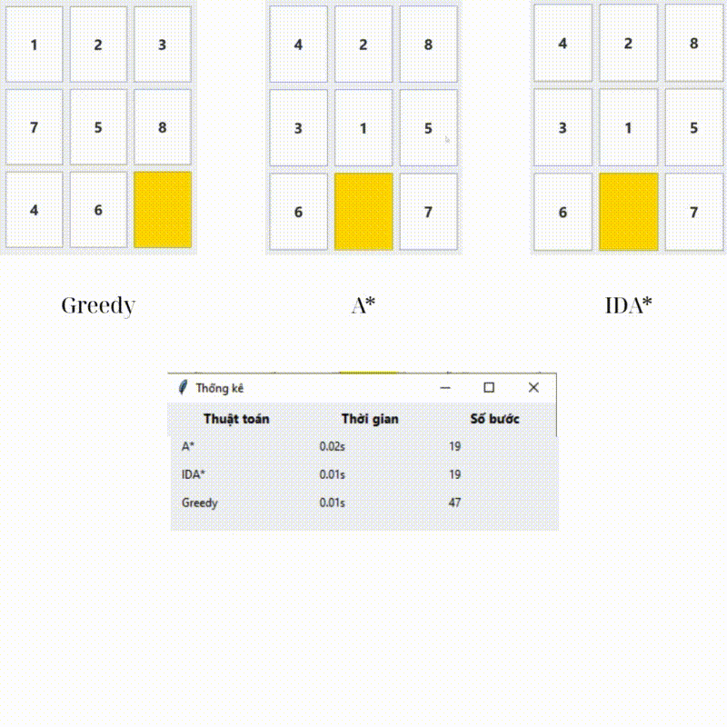
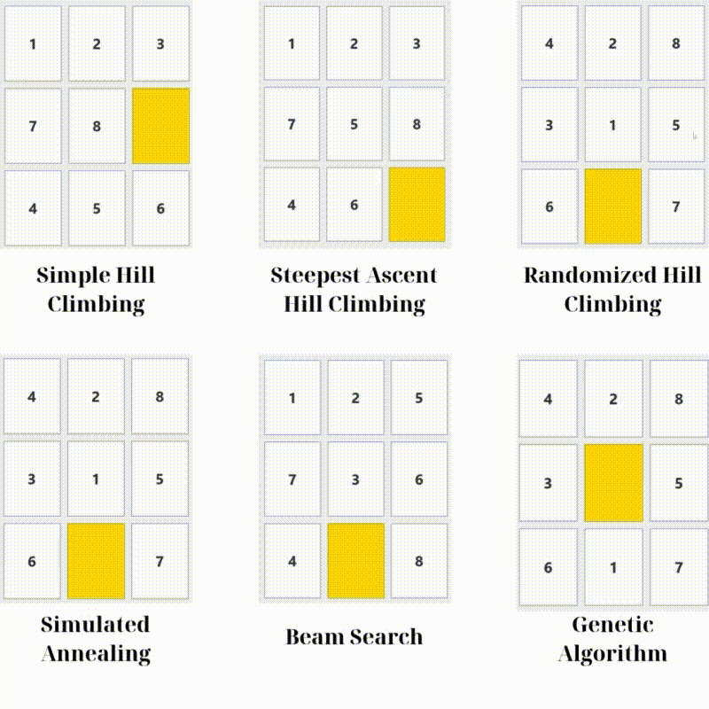
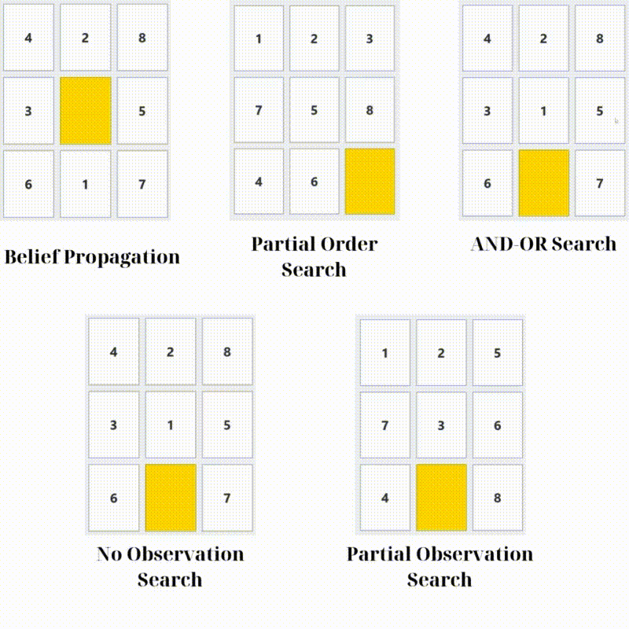
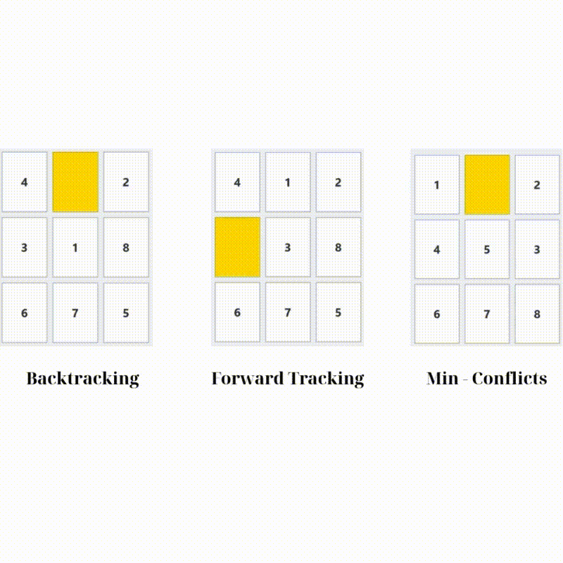
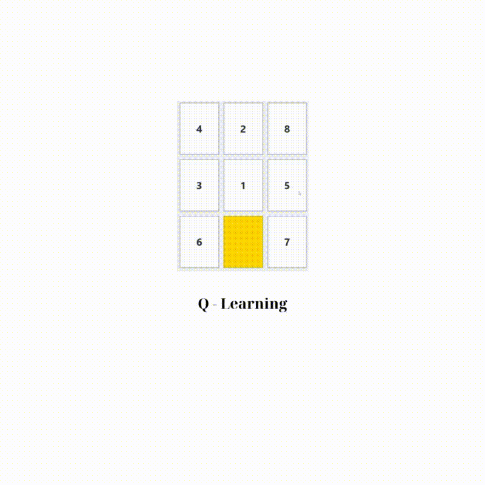

# ĐỒ ÁN CÁ NHÂN MÔN TRÍ TUỆ NHÂN TẠO

8-Puzzle là một trò chơi trí tuệ kinh điển, diễn ra trên bảng kích thước 3x3, gồm 8 ô được đánh số từ 1 đến 8 cùng một ô trống. Mục tiêu là di chuyển các ô sao cho chúng sắp xếp đúng thứ tự. Để giải bài toán này một cách hiệu quả và tối ưu, các thuật toán tìm kiếm trong trí tuệ nhân tạo (AI) thường được áp dụng nhằm tìm ra con đường ngắn nhất dẫn đến lời giải.
---
## Giới thiệu bài toán 8-Puzzle

8-Puzzle Solver là một ứng dụng phần mềm được phát triển nhằm giải bài toán 8-Puzzle – trò chơi sắp xếp các ô số trong lưới 3x3. Dự án được xây dựng bằng ngôn ngữ Python, sử dụng Tkinter để tạo giao diện đồ họa giúp người dùng tương tác trực quan với quá trình giải. Chương trình tích hợp nhiều thuật toán tìm kiếm khác nhau, cho phép so sánh hiệu quả giữa các phương pháp trong việc tìm ra lời giải.

---
## Nội dung chi tiết
### 1. Mục tiêu
Mục tiêu chính của dự án là phát triển một hệ thống linh hoạt và toàn diện để giải quyết bài toán 8-Puzzle – một trong những ví dụ kinh điển trong lĩnh vực trí tuệ nhân tạo (AI) và khoa học máy tính. Thay vì chỉ dừng lại ở việc xây dựng một công cụ tìm lời giải, chương trình hướng đến việc tạo ra một nền tảng hỗ trợ học tập, nghiên cứu và thử nghiệm với các thuật toán AI khác nhau. Dự án tích hợp từ các chiến lược tìm kiếm cơ bản đến những phương pháp hiện đại như học tăng cường, nhằm đem lại một công cụ hữu ích cho cả mục đích giáo dục và thực hành chuyên sâu trong lĩnh vực AI.

### 2. Nội dung
#### 2.1. Thuật toán tìm kiếm không có thông tin (Uninformed Search Algorithms)
Trong phần này, chương trình giải bài toán 8-Puzzle bằng các thuật toán tìm kiếm không sử dụng thông tin định hướng (heuristic). Dưới đây là các yếu tố then chốt trong mô hình bài toán:

- **Trạng thái khởi đầu:**
Là một bảng 3x3 chứa 8 ô số (từ 1 đến 8) và một ô trống (ký hiệu là 0) 
Ví dụ: [[1, 2, 3], [0, 5, 6], [4, 7, 8]]

- **Trạng thái mục tiêu:**
Là cấu hình đích chuẩn, trong đó các số được sắp xếp theo thứ tự tăng dần, và ô trống nằm ở góc dưới bên phải:
[[1, 2, 3], [4, 5, 6], [7, 8, 0]]

- **Không gian trạng thái:**
Bao gồm tất cả các cấu hình hợp lệ có thể tạo ra bằng cách di chuyển ô trống trong lưới 3x3 – tức là tập hợp toàn bộ trạng thái mà bài toán có thể trải qua.

- **Tập hành động:**
Tại mỗi bước, ô trống có thể di chuyển theo bốn hướng: lên, xuống, sang trái hoặc sang phải, để hoán đổi vị trí với ô số lân cận.

- **Chi phí hành động:**
Mỗi bước di chuyển có chi phí bằng 1. Mục tiêu là tìm ra chuỗi hành động có tổng chi phí thấp nhất dẫn đến trạng thái đích.

- **Chiến lược giải quyết:**
Chương trình áp dụng các thuật toán tìm kiếm không có thông tin để khám phá không gian trạng thái, bao gồm:

    + BFS (Breadth-First Search – Tìm kiếm theo chiều rộng)

    + DFS (Depth-First Search – Tìm kiếm theo chiều sâu)

    + UCS (Uniform Cost Search – Tìm kiếm theo chi phí đồng đều)

    + IDS (Iterative Deepening Search – Tìm kiếm theo độ sâu tăng dần)

  

---
**Đánh giá các thuật toán tìm kiếm:**

    + BFS (Tìm kiếm theo chiều rộng): Thuật toán này tiến hành duyệt qua các trạng thái theo từng lớp, bắt đầu từ gốc và mở rộng dần theo chiều rộng. Mặc dù đảm bảo tìm được lời giải ngắn nhất (nếu tồn tại), nhưng BFS lại tiêu tốn nhiều bộ nhớ, do phải lưu trữ tất cả các trạng thái đang chờ xử lý trong cùng một tầng – điều này trở nên đặc biệt bất lợi khi không gian trạng thái quá lớn như trong 8-Puzzle.

    + DFS (Tìm kiếm theo chiều sâu): DFS có lợi thế về mặt bộ nhớ vì chỉ cần lưu một nhánh duy nhất tại mỗi thời điểm. Tuy nhiên, nó dễ rơi vào tình trạng “đi lạc” – tức là có thể đi sâu vào những nhánh không có lời giải, trong khi lời giải thực tế lại nằm ở gần gốc. Điều này làm giảm hiệu quả của DFS trong các bài toán có không gian trạng thái rộng và lời giải nằm gần bề mặt.

    + UCS (Tìm kiếm theo chi phí đồng đều): Tương tự như BFS nhưng có thêm ưu tiên cho các trạng thái có chi phí tích lũy thấp hơn. Tuy nhiên, trong trường hợp 8-Puzzle – nơi mà mỗi bước di chuyển đều có chi phí bằng nhau – UCS hoạt động rất giống với BFS về mặt thực thi và kết quả.

    + IDS (Tìm kiếm sâu dần lặp lại): Đây là sự kết hợp giữa độ hiệu quả về bộ nhớ của DFS và khả năng bao quát của BFS. IDS lặp lại quá trình tìm kiếm theo độ sâu, mỗi lần tăng giới hạn độ sâu lên một đơn vị. Nhờ vậy, nó vừa tiết kiệm bộ nhớ, vừa đảm bảo tìm được lời giải ngắn nhất, khiến nó trở thành một lựa chọn phù hợp và hiệu quả cho bài toán 8-Puzzle.
---
**Tổng kết**

Trong số các thuật toán không sử dụng thông tin định hướng, IDS thường được đánh giá cao nhờ sự cân bằng giữa chi phí bộ nhớ và khả năng tìm ra lời giải hiệu quả. Trong khi đó, DFS có nguy cơ bị kẹt ở các nhánh không dẫn đến lời giải, khiến nó không phải là lựa chọn lý tưởng – đặc biệt là khi lời giải nằm ở mức độ nông trong không gian trạng thái.

---
#### 2.2. Nhóm thuật toán tìm kiếm có thông tin (Informed Search Algorithms)
**Cách tiếp cận bài toán và cấu trúc tổng quan**

- **Trạng thái khởi đầu:**
Bài toán bắt đầu với một bảng 3x3 chứa các số từ 1 đến 8 cùng một ô trống (được biểu diễn bằng số 0). Ví dụ: [[2, 0, 3], [1, 4, 6], [7, 5, 8]].

- **Trạng thái mục tiêu:**
Mục tiêu là đưa bảng về trạng thái hoàn chỉnh với các số được sắp xếp theo thứ tự từ trái sang phải, từ trên xuống dưới, và ô trống nằm ở vị trí cuối cùng: [[1, 2, 3], [4, 5, 6], [7, 8, 0]].

- **Không gian trạng thái:**
Bao gồm tất cả các hoán vị hợp lệ của 8 ô số và 1 ô trống trong khung lưới 3x3 – được tạo ra từ các hành động di chuyển hợp lệ trong quá trình giải.

- **Tập hành động:**
Tại mỗi bước, ô trống có thể di chuyển lên, xuống, trái hoặc phải để hoán đổi vị trí với một ô số liền kề – miễn sao thao tác không vượt ra ngoài giới hạn của lưới.

- **Chi phí hành động:**
Mỗi lần di chuyển được tính một chi phí bằng 1. Vì vậy, mục tiêu là tìm ra chuỗi hành động ngắn nhất có thể để đưa trạng thái hiện tại về trạng thái đích.

- **Chiến lược tiếp cận:**
Các thuật toán được sử dụng trong nhóm này đều khai thác thông tin định hướng (heuristic) nhằm tối ưu quá trình tìm kiếm. Ba thuật toán chính gồm:

    + Greedy Best-First Search (GBFS)

    + A* Search

    + Iterative Deepening A* (IDA*)

  

---
**Đánh giá và phân tích thuật toán**

- **GBFS (Tìm kiếm tham lam theo heuristic):**

GBFS ra quyết định dựa trên ước lượng khoảng cách từ trạng thái hiện tại đến đích (h(n)), bỏ qua chi phí đã đi. Nhờ vậy, thuật toán này thường có tốc độ nhanh, duyệt ít nút, nhưng lại dễ mắc kẹt ở những lời giải không tối ưu nếu heuristic không phản ánh đúng khoảng cách thực tế.

- **A Star (Tìm kiếm tối ưu dựa trên tổng chi phí):**

A* sử dụng hàm đánh giá f(n) = g(n) + h(n) – kết hợp giữa chi phí thực tế từ gốc đến trạng thái hiện tại (g(n)) và giá trị heuristic ước lượng từ trạng thái đó đến đích (h(n)). Nhờ sự cân bằng giữa thực tế và dự đoán, A* thường cho ra lời giải tối ưu. Tuy nhiên, nhược điểm là tiêu tốn bộ nhớ lớn, vì cần duy trì hàng đợi ưu tiên chứa nhiều trạng thái cùng lúc.

- **IDA Star (Tìm kiếm sâu dần có hướng dẫn):**

Đây là phiên bản cải tiến của A*, áp dụng kỹ thuật tìm kiếm sâu dần nhưng có tích hợp thông tin heuristic. Thuật toán lặp lại việc tìm kiếm nhiều lần, mỗi lần mở rộng giới hạn f(n) dựa trên kết quả lần trước. Ưu điểm của IDA* là tiết kiệm bộ nhớ đáng kể. Tuy nhiên, nếu heuristic chưa đủ chính xác, nó có thể phải duyệt lại nhiều trạng thái, làm giảm hiệu quả tổng thể.

---
**Tổng kết**

IDA* là phương án cân bằng tốt giữa tốc độ và mức sử dụng bộ nhớ. Đặc biệt hiệu quả nếu kết hợp với heuristic chất lượng cao để giảm số vòng lặp không cần thiết.

GBFS là lựa chọn phù hợp khi yêu cầu tốc độ nhanh và không quá đặt nặng việc tìm lời giải tối ưu nhất.

A* là giải pháp mạnh nếu mục tiêu là tìm được đường đi ngắn nhất với độ chính xác cao – dù phải đánh đổi bằng chi phí tài nguyên lớn hơn.

---
#### 2.3. Nhóm thuật toán tìm kiếm cục bộ (Local Optimization Algorithms)

**Thành phần bài toán và phương pháp giải quyết**

- **Trạng thái ban đầu:**
Xuất phát từ một bảng 3x3 chứa các số từ 1 đến 8 và một ô trống (0), ví dụ: [[1, 3, 6], [4, 2, 0], [7, 5, 8]].

- **Trạng thái đích:**
Mục tiêu là đưa bảng về cấu hình lý tưởng [[1, 2, 3], [4, 5, 6], [7, 8, 0]], nơi các số được sắp xếp theo thứ tự tăng dần và ô trống nằm ở vị trí cuối cùng.

- **Không gian trạng thái:**
Gồm toàn bộ các cấu hình hợp lệ của lưới 3x3, được hình thành qua việc di chuyển ô trống đến các vị trí khác nhau để hoán đổi với ô liền kề.

- **Tập hành động:**
Tại mỗi trạng thái, ô trống có thể di chuyển theo 4 hướng (trái, phải, lên, xuống) nếu không vượt ra ngoài giới hạn bảng.

- **Chi phí hành động:**
Mỗi thao tác di chuyển được tính là 1 đơn vị chi phí. Do đó, lời giải tốt nhất là lời giải ngắn nhất về số bước.

- **Cách tiếp cận giải bài toán:**
Các thuật toán trong nhóm này sử dụng chiến lược tối ưu cục bộ để dần tiến tới trạng thái mục tiêu, bao gồm:
Simple Hill Climbing (SHC), Steepest Ascent Hill Climbing (SAHC), Simulated Annealing (SA), Beam Search (BS), Genetic Algorithm (GA) và Random Hill Climbing (RHC).

  

---
**Đánh giá các thuật toán**

- **SHC (Leo đồi đơn giản):**
Ưu tiên trạng thái lân cận đầu tiên tốt hơn trạng thái hiện tại và dừng ngay khi không còn cải thiện. Do không kiểm tra toàn bộ lân cận và không có cơ chế thoát cực trị, SHC chạy nhanh nhưng dễ bị mắc kẹt.

- **SAHC (Leo đồi theo độ dốc lớn nhất):**
Thay vì chọn ngẫu nhiên, SAHC duyệt toàn bộ trạng thái lân cận để chọn bước tốt nhất. Điều này giúp tránh kẹt ở điểm yếu hơn SHC, nhưng thời gian xử lý mỗi bước dài hơn.

- **SA (Làm nguội mô phỏng):**
Áp dụng chiến lược chấp nhận trạng thái xấu hơn trong một số tình huống với xác suất giảm dần theo thời gian (làm nguội). Điều này giúp SA có thể thoát khỏi cực trị cục bộ hiệu quả hơn hai phương pháp leo đồi.

- **BS (Tìm kiếm chùm):**
Giới hạn số lượng trạng thái được mở rộng tại mỗi bước (ví dụ: 5 trạng thái tốt nhất), giúp tăng tốc tìm kiếm. Tuy nhiên, nếu chọn beam width quá nhỏ, BS có thể bỏ lỡ lời giải tốt.

- **GA (Thuật toán di truyền):**
Lấy cảm hứng từ tiến hóa sinh học, GA hoạt động dựa trên các quần thể trạng thái, chọn lọc và tái tổ hợp để tìm lời giải. Tuy hoạt động tốt trong việc bao phủ không gian rộng, nhưng tốc độ chậm và tiêu tốn nhiều tài nguyên.

- **RHC (Leo đồi ngẫu nhiên):**
Chỉ chọn ngẫu nhiên một trạng thái lân cận tốt hơn thay vì duyệt hết như SAHC. Thời gian xử lý nhanh hơn SAHC nhưng dễ bỏ sót các bước tốt hơn.
---
**Kết luận**

GA phù hợp với các bài toán cần khai phá toàn diện không gian tìm kiếm và tìm lời giải tối ưu, dù chi phí về thời gian và bộ nhớ cao.

SA là một lựa chọn cân bằng tốt giữa hiệu suất và khả năng tránh cực trị cục bộ, hoạt động ổn định với nhiều loại bài toán.

BS cho kết quả nhanh hơn GA và SA nếu cấu hình đúng, tuy nhiên cần lựa chọn tham số beam width cẩn thận để không bỏ lỡ lời giải.

Các thuật toán Hill Climbing (SHC, SAHC, RHC) hoạt động nhanh và ít tốn tài nguyên, nhưng dễ bị mắc kẹt ở cực trị cục bộ. SHC là đơn giản nhất nhưng kém hiệu quả nhất. SAHC và RHC có cải tiến nhưng vẫn còn hạn chế trong việc khai phá không gian tìm kiếm rộng.

#### 2.4. Các thuật toán tìm kiếm trong môi trường phức tạp (Search In Complex Environments)**

**Mô hình bài toán và phương pháp tiếp cận**

- **Trạng thái khởi đầu:**

    + AND-OR Search: Thuật toán này bắt đầu từ một bảng 3x3 điển hình với các số từ 1 đến 8 và một ô trống (ký hiệu là 0), chẳng hạn như [[1, 2, 3], [4, 5, 6], [7, 0, 8]].

    + Belief State Search: Thiết lập ban đầu là một tập hợp các trạng thái niềm tin (belief states), gồm trạng thái gốc và hai trạng thái kế cận, nhằm mô tả những khả năng xảy ra trong một môi trường mà người dùng không thể quan sát trực tiếp.

    + Partial Observable Search (POS): Khởi động từ tập hợp các belief states có điểm chung là số 1 nằm ở ô (0,0), được xây dựng dựa trên khả năng quan sát một phần thông tin từ trạng thái ban đầu và lân cận.

- **Trạng thái đích:**
Mục tiêu cuối cùng là đưa bảng về trạng thái chuẩn [[1, 2, 3], [4, 5, 6], [7, 8, 0]], trong đó các số được sắp xếp theo thứ tự tăng dần và ô trống nằm ở cuối cùng.

- **Không gian trạng thái:**
Bao gồm cả các trạng thái rõ ràng (có thể quan sát đầy đủ) và các trạng thái mang tính bất định, được hình thành trong quá trình di chuyển ô trống và đối mặt với các yếu tố thiếu thông tin.

- **Tập hành động:**
Tại mỗi bước, ô trống có thể di chuyển theo bốn hướng cơ bản. Tuy nhiên, trong môi trường không chắc chắn hoặc chỉ quan sát một phần, một hành động có thể dẫn đến nhiều trạng thái khác nhau, phản ánh tính không xác định của hệ thống.

- **Chi phí dịch chuyển:**
Mỗi bước di chuyển được gán chi phí bằng 1. Dù thông tin đầu vào có thể không đầy đủ, các thuật toán vẫn hướng đến việc tìm ra lộ trình ngắn nhất để đạt được mục tiêu.

- **Chiến lược giải quyết:**
Các phương pháp như AND-OR Search, Belief State Search, và POS đều tìm cách xử lý các tình huống phức tạp thông qua việc duy trì và cập nhật các tập hợp belief states. Mục tiêu là tìm ra chuỗi hành động có thể áp dụng cho toàn bộ các kịch bản khả dĩ trong môi trường không rõ ràng.

  

---
- **Phân tích thuật toán:**

    + AND-OR Search: Thích hợp cho các môi trường có tính bất định cao, thuật toán này xử lý toàn bộ cây tìm kiếm bao gồm cả nhánh AND mà không loại bỏ các nhánh không cần thiết. Dù mỗi trạng thái được xử lý khá nhanh do không sử dụng heuristic, số lượng trạng thái phát sinh rất lớn vì không thu hẹp được không gian tìm kiếm.

    + Belief State Search: Hoạt động hiệu quả trong các môi trường không thể quan sát trực tiếp. Thuật toán sử dụng heuristic để chọn lọc và giữ lại ba trạng thái có tiềm năng nhất, từ đó giảm bớt sự không chắc chắn. Tuy nhiên, vì phải tính toán heuristic nhiều lần nên chi phí xử lý cũng cao hơn đáng kể.

    + Partial Observable Search (POS): Được áp dụng khi có thể thu được một phần thông tin từ môi trường. POS sử dụng dữ liệu quan sát để loại bỏ sớm những trạng thái không phù hợp, giúp thu hẹp không gian tìm kiếm đáng kể. Nhờ vậy, thời gian xử lý và số bước đi thường tối ưu hơn so với hai phương pháp còn lại.
---
**Kết luận**

POS là lựa chọn ưu tiên nếu cần cân bằng giữa hiệu quả tính toán và quy mô không gian trạng thái, nhờ tận dụng thông tin quan sát để loại trừ các khả năng không hợp lệ.

Belief State Search phù hợp với môi trường hoàn toàn không thể quan sát, tuy nhiên đòi hỏi chi phí tính toán cao và không gian tìm kiếm lớn hơn.

AND-OR Search có lợi thế về tốc độ xử lý từng trạng thái, nhưng lại tạo ra nhiều nhánh dư thừa, nên chỉ thích hợp trong những trường hợp trạng thái ban đầu đã gần đạt đến mục tiêu và không cần giới hạn phạm vi tìm kiếm.

#### 2.5. Nhóm thuật toán tìm kiếm theo ràng buộc (Constraint Satisfaction Problem – CSP)
**Mô hình bài toán và phương pháp tiếp cận**

- **Trạng thái khởi đầu:**
Bài toán bắt đầu với một ma trận 3x3 trống rỗng: [[None, None, None], [None, None, None], [None, None, None]]. Nhiệm vụ là gán các số từ 0 đến 8 vào các ô sao cho mọi điều kiện ràng buộc được đảm bảo.

- **Trạng thái mục tiêu:**
Cấu hình hợp lệ mong muốn là [[1, 2, 3], [4, 5, 6], [7, 8, 0]] – trạng thái chuẩn của bài toán 8-Puzzle, nơi các số được sắp xếp theo thứ tự và ô trống nằm ở góc dưới bên phải.

- **Không gian trạng thái:**
Tập hợp tất cả các cách gán giá trị cho từng ô trong bảng 3x3, nhưng bị giới hạn bởi một loạt điều kiện sau:

    + Ô đầu tiên (vị trí (0,0)) bắt buộc phải là số 1.

    + Mỗi số từ 0 đến 8 chỉ được xuất hiện một lần duy nhất.

    + Theo hàng ngang: mỗi ô bên phải phải lớn hơn ô bên trái đúng 1 đơn vị (ngoại trừ ô trống).

    + Theo cột dọc: mỗi ô phía dưới phải lớn hơn ô phía trên đúng 3 đơn vị (trừ ô trống).

    + Cấu hình phải có thể giải được – tức số lượng cặp nghịch đảo trong bảng là một số chẵn.

- **Tập hành động:**
Giải pháp tiến hành bằng cách gán dần từng giá trị cho các ô, thông qua:

    + Backtracking: thử từng giá trị một cách tuần tự, quay lui khi phát hiện xung đột.

    + Forward Checking: sau mỗi bước gán, loại bỏ trước các giá trị không còn hợp lệ khỏi tập giá trị khả thi của các ô còn lại.

- **Chi phí tính toán:**
Khác với các bài toán tối ưu, CSP không yêu cầu đường đi ngắn nhất mà chỉ cần một cấu hình hợp lệ duy nhất thỏa mãn mọi điều kiện ràng buộc.

- **Đầu ra:**
Là một dãy các phép gán tuần tự, bắt đầu từ bảng trống và kết thúc ở trạng thái đích hợp lệ. Các thuật toán như Backtracking và Forward Checking đảm bảo kết quả chỉ được chấp nhận nếu tất cả ràng buộc được thỏa mãn.

  

---
**Phân tích thuật toán**

- **Backtracking:**
Đây là một kỹ thuật tìm kiếm theo chiều sâu đơn giản. Mỗi bước kiểm tra một phép gán và quay lui nếu phát hiện mâu thuẫn. Mặc dù dễ cài đặt, nhưng với không gian tìm kiếm rộng, nó dễ bị rơi vào việc duyệt lặp không cần thiết.

- **Forward Checking:**
Là phiên bản cải tiến của Backtracking. Mỗi lần gán một giá trị, thuật toán sẽ cập nhật lại domain (tập giá trị hợp lệ còn lại) của các ô chưa gán, từ đó loại bỏ sớm các khả năng xung đột. Nó có thể được kết hợp với:

    + MRV (Minimum Remaining Values): chọn ô có ít lựa chọn nhất trước.

    + LCV (Least Constraining Value): chọn giá trị ít gây ràng buộc cho các ô khác nhất.

Nhờ những kỹ thuật này, số trạng thái cần kiểm tra giảm đáng kể, nhưng chi phí xử lý mỗi bước lại tăng do phải duy trì và cập nhật domain liên tục.

- **Min-Conflicts Search:**
Thuật toán này tiếp cận bài toán bằng cách gán thử các giá trị và từng bước sửa chữa các xung đột. Kỹ thuật Simulated Annealing được dùng để tránh rơi vào các điểm kẹt (local minima). Nhờ đó, số lượng trạng thái cần khám phá thường ít nhất trong nhóm, nhưng mỗi bước đòi hỏi tính toán xung đột phức tạp hơn.
---
**Kết luận**

Backtracking phù hợp với những bài toán nhỏ hoặc cấu trúc ràng buộc đơn giản, nhưng không hiệu quả nếu không gian tìm kiếm lớn.

Forward Checking là lựa chọn tốt hơn trong các bài toán phức tạp, giúp giảm số lượng trạng thái cần xét, đặc biệt khi kết hợp với MRV và LCV.

Min-Conflicts Search mang lại hiệu quả cao nhất về số trạng thái và thời gian, nhất là khi trạng thái ban đầu gần với trạng thái đích và bài toán có nhiều xung đột tiềm ẩn.

#### 2.6. Nhóm thuật toán học tăng cường (Reinforcement Learning)
**Trạng thái ban đầu:**
Agent bắt đầu quá trình học với một ma trận 3x3 chứa các số từ 1 đến 8 và một ô trống (được biểu diễn bằng số 0), ví dụ: [[4, 1, 3], [7, 2, 6], [0, 5, 8]]. Đây chính là điểm xuất phát để Q-Learning xây dựng chiến lược giải quyết bài toán.

**Trạng thái mục tiêu:**
Đích đến là cấu hình chuẩn: [[1, 2, 3], [4, 5, 6], [7, 8, 0]], trong đó các số được sắp xếp theo thứ tự tăng dần và ô trống nằm ở góc dưới cùng bên phải của bảng.

**Không gian trạng thái:**
Không gian tìm kiếm gồm toàn bộ các hoán vị hợp lệ của ma trận 3x3, được sinh ra thông qua việc di chuyển ô trống để hoán đổi vị trí với các ô lân cận. Trong quá trình huấn luyện, Q-Learning sẽ dần khám phá không gian này để xây dựng chính sách hành động tối ưu cho từng tình huống.

**Tập hành động:**
Tại mỗi bước, agent có thể chọn một trong bốn hành động: di chuyển lên, xuống, sang trái hoặc phải, tùy theo vị trí hiện tại của ô trống. Những hành động vượt ra khỏi biên của bảng sẽ bị loại bỏ.

**Cơ chế phần thưởng:**
Thay vì sử dụng chi phí như trong các thuật toán truyền thống, Q-Learning áp dụng hệ thống phần thưởng để điều hướng hành vi học. Mỗi bước di chuyển thông thường sẽ nhận một phần thưởng âm nhẹ, giúp khuyến khích agent tìm đường ngắn nhất. Khi đạt đến trạng thái đích, agent nhận được một phần thưởng lớn dương, đánh dấu sự thành công của hành động đó.

**Chiến lược học:**
Q-Learning xây dựng một bảng giá trị gọi là Q-table, trong đó mỗi cặp (trạng thái, hành động) được gán một giá trị thể hiện mức độ hữu ích của hành động đó tại trạng thái tương ứng. Thông qua quá trình thử nghiệm – vừa khám phá hành động mới (exploration), vừa khai thác kiến thức đã học (exploitation) – agent dần điều chỉnh Q-table để học ra chuỗi hành động tối ưu. Sau khi huấn luyện đầy đủ, bảng Q này có thể được dùng để giải bài toán từ bất kỳ trạng thái hợp lệ nào.

  

---
### 3. Tác giả
Sinh viên thực hiện: Đoàn Vĩnh Phát – MSSV: 23110283
Đây là đồ án cá nhân phục vụ mục đích học tập, đồng thời là công trình nghiên cứu và thử nghiệm các thuật toán tìm kiếm trí tuệ nhân tạo (AI) trên bài toán 8-Puzzle, với định hướng tối ưu hóa hiệu suất và nâng cao trải nghiệm người dùng.

---
### 4. Tài liệu tham khảo
S. J. Russell & P. Norvig, Artificial Intelligence: A Modern Approach, 4th ed., Pearson, 2020.

S. J. Russell & P. Norvig, Artificial Intelligence: A Modern Approach, 3rd ed., Pearson, 2016.

Một số công cụ hỗ trợ như: ChatGPT, Cursor,…

